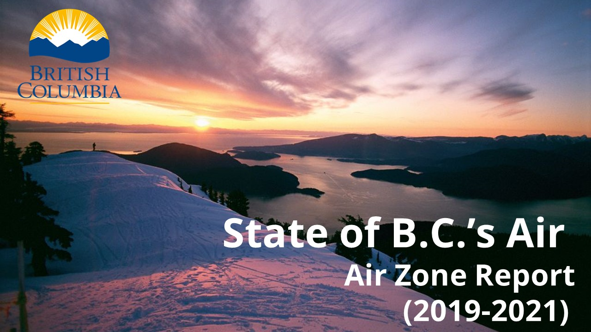

```{=html}

     <html lang="en">

<head>
    <meta charset="utf-8"/>
    <meta http-equiv="X-UA-Compatible" content="IE=edge"/>
    <meta name="viewport" content="width=device-width, initial-scale=1"/>
    <!-- The above 3 meta tags *must* come first in the head; any other head content must come *after* these tags -->
    <meta name="HandheldFriendly" content="true"/>
    <meta name="description" content=""/>
    <meta name="author" content=""/>
    <meta name="navigaton_title" content=""/>
    <meta name="dcterms.publisher" content="Province of British Columbia"/>
    <meta name="dcterms.created" content="2015-06-05"/>
    <meta name="dcterms.modified" content="2016-12-30"/>
    <meta name="security_label" content="Public"/>
    <meta name="security_classification" content="Low"/>
    <meta name="dcterms.subject" content=""/>
    <meta name="dcterms.subject" content=""/>
    <meta name="dcterms.creator" content=""/>
    <meta name="dcsext.creator" content=""/>
    <meta name="dcterms.language" content="eng"/>
    <meta name="description" content=""/>
    <meta name="keywords" content="">
    <link rel="apple-touch-icon" sizes="57x57" href="icons/apple-icon-57x57.png"/>
    <link rel="apple-touch-icon" sizes="60x60" href="icons/apple-icon-60x60.png"/>
    <link rel="apple-touch-icon" sizes="72x72" href="icons/apple-icon-72x72.png"/>
    <link rel="apple-touch-icon" sizes="76x76" href="icons/apple-icon-76x76.png"/>
    <link rel="apple-touch-icon" sizes="114x114" href="icons/apple-icon-114x114.png"/>
    <link rel="apple-touch-icon" sizes="120x120" href="icons/apple-icon-120x120.png"/>
    <link rel="apple-touch-icon" sizes="144x144" href="icons/apple-icon-144x144.png"/>
    <link rel="apple-touch-icon" sizes="152x152" href="icons/apple-icon-152x152.png"/>
    <link rel="apple-touch-icon" sizes="180x180" href="icons/apple-icon-180x180.png"/>
    <link rel="icon" type="image/png" sizes="192x192" href="icons/android-icon-192x192.png"/>
    <link rel="icon" type="image/png" sizes="32x32" href="icons/favicon-32x32.png"/>
    <link rel="icon" type="image/png" sizes="96x96" href="icons/favicon-96x96.png"/>
    <link rel="icon" type="image/png" sizes="16x16" href="icons/favicon-16x16.png"/>
    <link rel="manifest" href="icons/manifest.json"/>
    <link rel="icon" type="image/png" href="images/favicon.ico"/>
    <meta name="msapplication-TileColor" content="#ffffff"/>
    <meta name="msapplication-TileImage" content="icons/ms-icon-144x144.png"/>
    <meta name="theme-color" content="#ffffff"/>

    <title>Air Zone Report</title>

     <!-- BOOTSTRAP CORE CSS v3.3.6 -->
    <link rel="stylesheet" href="css/bootstrap.min.css"/>

    <!-- IE10 viewport hack for Surface/desktop Windows 8 bug -->
    <link rel="stylesheet" href="css/ie10-viewport-bug-workaround.css"/>

    <!-- STANDARD CSS -->
    <link type="text/css" href="css/main.css" rel="stylesheet"/>

    <!-- FONTS -->
    <link rel="stylesheet" href="https://maxcdn.bootstrapcdn.com/font-awesome/4.5.0/css/font-awesome.min.css"/>

    <!-- CUSTOM CSS -->
    <link href="css/custom-main.css" rel="stylesheet"/>
    <link href="css/custom-form.css" rel="stylesheet"/>


    <!-- HTML5 shim and Respond.js for IE8 support of HTML5 elements and media queries -->
    <!--[if lt IE 9]>
      <script src="https://oss.maxcdn.com/html5shiv/3.7.2/html5shiv.min.js"></script>
      <script src="https://oss.maxcdn.com/respond/1.4.2/respond.min.js"></script>
    <![endif]-->
<script>
        // Smooth scrolling animation when clicking on a breadcrumb link
        document.addEventListener('DOMContentLoaded', function() {
            document.querySelectorAll('a[href^="#"]').forEach(function(anchor) {
                anchor.addEventListener('click', function(e) {
                    e.preventDefault();

                    var target = document.querySelector(this.getAttribute('href'));
                    var position = target.getBoundingClientRect().top + window.pageYOffset - 100;

                    window.scrollTo({
                        top: position,
                        behavior: 'smooth'
                    });
                });
            });
        });
    </script>
    
</head>


    <!-- HEADER -->
    <div id="header" role="banner">
        <div id="header-main" class="navbar navbar-default navbar-fixed-top">
            <div class="container">
                <div id="header-main-row" class="row">
                    <!-- GOV TITLE -->
                    <div class="col-sm-3 col-md-2 col-lg-2 header-main-left">
                        <div id="logo">
                            <a href="http://gov.bc.ca"></a>
                        </div>
                        <div id="access">
                            <ul>
                                <li aria-label="Keyboard Tab Skip">
                                    <a accesskey="0" href="#main-content-anchor" aria-label="Skip to main content">Skip to main content</a>
                                </li>
                                <li aria-label="Keyboard Tab Skip">
                                    <a accesskey="0" href="#navigation-anchor" aria-label="Skip to navigation" aria-label="Skip to navigation">Skip to navigation</a>
                                </li>
                                <li aria-label="Keyboard Tab Skip">
                                    <a accesskey="0" href="http://gov.bc.ca/webaccessibility/" aria-label="Accessibility Statement">Accessibility Statement</a>
                                </li>
                            </ul>
                        </div>
                        <button type="button" class="navbar-toggle gov-button-custom collapsed" data-toggle="collapse" data-target="#navbar" aria-expanded="true" aria-label="Burger Navigation">
                            
                        </button>
                    </div>
                    <div class="col-sm-8 col-md-8 col-lg-6 hidden-xs">
                      
                    </div>
                    <!-- /GOV & ENV TITLE -->

                    <!-- /COLLAPSING NAVBAR -->
                </div>
            </div>
            
            
            
            <div class="navigationRibbon">
                <div class="level2Navigation">
                    <div class="container">
                        <a href="#Welcome">Welcome</a>
                        <a href="#AQManagement">Air Quality Management</a>
                        <a href="#Pollutants">Pollutants</a>
                        <a href="#AQTrends">Air Quality Trends</a>
                        <a href="#EmissionTrends">Emission Trends</a>
                        <a href="#Monitoring">Monitoring</a>
                        <a href="#ManagementLevels">Management Levels</a>
                        <a href="#Wildfire">Wildfire</a>
                        <a href="#Summary">Summary</a>

                    </div>
                </div>
            </div>
            
           
            
        </div>
    </div>
    <!-- /HEADER -->
    <!-- BODY CONTENT -->

    <!-- /BODY CONTENT -->
    <!--div id="shareIcons">
   <!-- Bootstrap core JavaScript
    ================================================== -->
    <!-- Placed at the end of the document so the pages load faster -->
    <!-- jQuery (necessary for Bootstrap's JavaScript plugins) -->
    <script src="https://ajax.googleapis.com/ajax/libs/jquery/1.11.3/jquery.min.js"></script>
    <!-- Include all compiled plugins (below), or include individual files as needed -->
    <script src="js/bootstrap.min.js"></script>
    <script src="js/misc.js"></script>
    <script src="js/navMenu.js"></script>
    <!-- IE10 viewport hack for Surface/desktop Windows 8 bug -->
    <script src="js/ie10-viewport-bug-workaround.js"></script>

   

 

    </div>
<!--
</body>

</html>
-->
```
<!--# Modify Breadcrumbs here. These are navigation tools to guide user through windows -->

```{=html}

      <div id="topicTemplate" class="template container gov-container">
        <div id="breadcrumbContainer">
            <ol class="breadcrumb">
<!--
                <li>
                    <a href="#">Air Zone Report</a>
                </li>
                
                <li>
                    <a href="#">Breadcrumb Link</a>
                </li>
                <li>
                    <a href="#">Breadcrumb Link</a>
                </li>
                <li>
                    <a href="#">Breadcrumb Link</a>
                </li>

            </ol>
        </div>
      --> 
    </div>
    
    <body style="background-color:#fff";>
    
    
```
```{r,message=FALSE,echo=FALSE,results='hide',warning=FALSE}
#knitr::include_app("../test/etest_ppt.html")
#setup
validation_year <- 2021
sourcefiles <- '../assets'
datafiles <- '../data/out'


for (files_ in list.files(sourcefiles)) {
  print(files_)
  try(source(paste(sourcefiles,files_,sep='/')))
  
}

```

 <!-- Welcome Page -->

```{=html}
<!-- Jumping Points -->
<a id="Welcome"></a>
```
```{=html}
<!--
<div>
<object data="../test/etest_ppt.html" frameborder="0"  style="padding-top:0%;"></object>
</div>
      

<div>
  <div style="padding-top:0%;background-color: yellow;">
    <object data="../test/etest_ppt.html" frameborder="0" allowfullscreen
      style="width:100%;height:100%;"></object>
  </div>
</div>
-->
```
```{=html}
<div class="row"><div class="blue-section"><center><h2 class="blue-heading-bar">Welcome!</h2></center></div></div>
```
Air zone reports are prepared each year by the B.C. Ministry of Environment and Climate Change Strategy to summarize the levels of air pollution in areas referred to as "air zones". This report is part of our commitment under the national [Air Quality Management System (AQMS)](https://ccme.ca/en/air-quality-report#slide-2) which aims to better protect human health and the environment.

The annual report titled "Air Zone Report (`r validation_year-2`-`r validation_year`)" serves as a comprehensive overview of B.C.'s air quality status. It assesses the achievement of the [Canadian Ambient Air Quality Standards (CAAQS)](https://ccme.ca/en/air-quality-report#slide-7) and assigns colour-based management levels for the four major pollutants: fine particulate matter (PM~2.5~), ozone(O~3~), nitrogen dioxide (NO~2~), and sulphur dioxide (SO~2~). These management levels are evaluated based on three years (`r validation_year-2`-`r validation_year`) of monitoring data. Guided by the principles of the AQMS, these management levels corresponds to the level of actions that are recommended for communities to keep clean areas clean and continuously improve air quality.

Please read and enjoy the interactive air zone report below. You can also view [the summary document](#Summary), and explore the air quality data. 

<center>{width="50%"}</center>

## Land Acknowledgement

<b>We acknowledge with respect and gratitude</b> that this report was produced on the territory of the  Lək̓ ʷəŋən peoples, and recognize the Songhees and Esquimalt (Xwsepsum), and WSÁNEĆ Nations whose deep connections with this land continue to this day.
</br> </br> </br> </br> <!-- Air Quality Management Page -->

```{=html}
<!-- Jumping Points -->
<a id="AQManagement"></a>
<div class="row"><div class="blue-section"><center><h2 class="blue-heading-bar">Air Quality Management in B.C.</h2></center></div></div>
```
Air pollution is recognized as one of the greatest environmental threats to human health ([WHO 2022](https://www.who.int/news-room/fact-sheets/detail/ambient-(outdoor)-air-quality-and-health)). According to Health Canada estimates, approximately 15,300 Canadians--1,900 in British Columbia--die prematurely every year due to exposure to air pollution ([Health Canada 2021](https://www.canada.ca/en/health-canada/services/publications/healthy-living/2021-health-effects-indoor-air-pollution.html#a2)). In order to protect human health and guide work on air emissions, various jurisdictions and levels of government agreed to implement a national Air Quality Management System.

The Air Quality Management System (AQMS) provides a collaborative and comprehensive approach to managing ambient (outdoor) air quality. It is implemented across Canada to reduce emissions and levels of major air pollutants. To assist in managing air quality, provinces and territories divide their jurisdictions into defined areas called air zones.

British Columbia is divided into seven different air zones. Click on the map below to view the details of B.C.'s air zones.

```{=html}
<style>
.main-container {
  max-width: unset;
}
</style>
```
```{r, echo=FALSE,out.width="100%"}

#located in air-zone-reports/level2_page/shiny_AirZoneExplained.R
 knitr::include_app('https://bcgov-env.shinyapps.io/airzoneexplained/',height = "700px")
```

```{=html}
<!-- Jumping Points -->
<a id="Pollutants"></a>
<div class="row"><div class="blue-section"><center><h2 class="blue-heading-bar">Major Ambient (Outdoor) Air Pollutants</h2></center></div></div>
```
# Four pollutants are presented in this report


```{r echo=FALSE, out.width="300px", fig.align='right'}
# this creates a sidebar image
# knitr::include_graphics("https://www.shutterstock.com/image-vector/blue-waves-fresh-aroma-showing-600w-2086461628.jpg")

```

The four pollutants listed below are recognized for having the most significant evidence of causing health concerns. As a result, these pollutants are the primary focus of health studies and are among the first to have established air quality objectives. The Canadian Ambient Air Quality Standards (CAAQS) were developed in 2012 and has been established as national air quality objectives under the [Canadian Environmental Protection Act](https://www.canada.ca/en/environment-climate-change/services/canadian-environmental-protection-act-registry/guidelines-objectives-codes-practice/guidelines-objectives.html). The initial CAAQS were defined for fine particulate matter (PM<sub>2.5</sub>) and ground-level ozone (O<sub>3</sub>) then later updated to include nitrogen dioxide (NO<sub>2</sub>) and sulphur dioxide(SO<sub>2</sub>). The CAAQS are considered as national air quality objectives under the [Canadian Environmental Protection Act](https://www.canada.ca/en/environment-climate-change/services/canadian-environmental-protection-act-registry/guidelines-objectives-codes-practice/guidelines-objectives.html).

The CAAQS serve as benchmarks, defining acceptable levels known as metrics for each pollutant. Three out of the four major pollutants are characterized by two CAAQS metrics representing short-term and long-term exposures. These metrics are presented as follows and are calculated for every monitoring station that are designated to report CAAQS under the Air Quality Management System:

- A numerical value representing the concentration or level of the measured pollutant.

- A unit of measurement defining the type of quantity represented by the numerical value, such as micrograms per cubic meter (μg/m³) for fine particulate matter.

- A statistical format specifying how the numerical value was calculated using raw measurements, such as an annual average or a maximum daily average.

Click on the banners below to learn more about each major pollutant.

```{=html}

<head>
<meta name="viewport" content="width=device-width, initial-scale=1">
<style>
.accordion {
  background-color: #eee;
  color: #444;
  cursor: pointer;
  padding: 14px;
  width: 100%;
  border: none;
  text-align: left;
  outline: none;
  font-size: 20px;
  transition: 0.4s;
}

.active, .accordion:hover {
  background-color: #ccc;
}

.panel {
  padding: 0 14px;
  background-color: white;
  max-height: 0;
  overflow: hidden;
  transition: max-height 0.2s ease-out;
}
</style>
</head>

<!--body> -->
```
<!--PM2.5 Picture and Accordion -->

```{=html}
<button class="accordion">Fine Particulate Matter (PM<sub>2.5</sub>)</button>
<div class="panel">
  
<div style="float:left;position: relative; right: 5px; top: 0px;">
<p></p>
</div>
 <p>
```
<!---PM2.5 Text-->

Fine particulate matter (PM<sub>2.5</sub>) consists of solid particles or liquid droplets suspended in the air, with sizes smaller than or equal to 2.5 micrometres (µm) in diameter. PM<sub>2.5</sub> is commonly found in smoke, soot, dust, dirt, dispersed aerosols, and biological sources such as mold, bacteria, pollen, and animal dander. Upon inhalation, these particles can penetrate deep into the lungs and bloodstream, potentially causing adverse health effects like cardiovascular and respiratory diseases. PM<sub>2.5</sub> is considered a non-threshold pollutant, meaning that associated health effects occur at any level of exposure.

**Health Effects:**

-   cardiovascular and respiratory mortality

-   reduced lung function

-   chronic bronchitis

-   asthma

**Measurement and Reporting**

PM<sub>2.5</sub> levels are presented using these metrics:

-   an [annual metric](## "Determined by calculating the yearly average of daily values and subsequently averaging it over three consecutive years.") to estimate chronic or long term exposure

-   a [24-hour metric](## "Determined by calculating the 98th percentile of the daily values and subsequently averaging it over three consecutive years.") to estimate short term or acute exposure

**Standards and Management Levels for PM**<sub>2.5</sub>

The table below shows values of the Canadian Ambient Air Quality Standards for each metric of PM<sub>2.5</sub> and the colour-based management levels. These levels were established as part of the Air Quality Management System and are determined using both annual and 24-hour metrics. Each colour corresponds to a recommended management action intended to reduce PM<sub>2.5</sub> emissions and levels.

`r get_tbl_management('pm25')`

```{=html}
  </p>
</div>

<button class="accordion">Ground-Level Ozone (O<sub>3</sub>)</button>
<div class="panel">
<div style="float:left;position: relative; right: 5px; top: 0px;">
<p></p>
</div>
 <p>
```
Ground-level ozone (O<sub>3</sub>), is a colourless, odourless and highly irritating gas that forms near the Earth's surface. It is also a major component of smog. In contrast to "primary" pollutants which are emitted directly into the atmosphere from pollutant sources, O<sub>3</sub> is classified as a "secondary" pollutant due to its formation through complex chemical reactions between nitrogen oxides (NOx) and volatile organic compounds (VOCs) in the presence of sunlight. 

While ground-level O<sub>3</sub> poses significant environmental and health concern, approximately 10 to 40 kilometres above the Earth's surface, a beneficial layer of ozone called stratospheric ozone exists. This layer shields the earth from harmful ultraviolet radiation. Ozone is also a short-lived climate pollutant and also contributes to climate change.

**Health Effects:**

-   coughing

-   irritation of the eyes, nose, throat

-   shortness of breath

-   reduced lung function

**Measurement and Reporting**

In this report, O<sub>3</sub> levels are presented using the [8-hour metric](## "Determined by selecting the highest daily 1-hour value, identifying the annual 98th percentile (8th highest) among these daily maximums, and then averaging it over three consecutive years."). 

**Standards and Management Levels for O<sub>3</sub>**

The table below shows values of the Canadian Ambient Air Quality Standards for the 8-hour metric of O<sub>3</sub> and the colour-based management levels. These levels were established as part of the Air Quality Management System. Each colour corresponds to a recommended management action intended to reduce O<sub>3</sub> formation and levels.
`r get_tbl_management('o3')`

```{=html}
  </p>
</div>

<button class="accordion">Nitrogen Dioxide (NO<sub>2</sub>)</button>
<div class="panel">
<div style="float:left;position: relative; right: 5px; top: 0px;">
<p></p>
</div>
  <p>
```
Nitrogen dioxide (NO<sub>2</sub>) belongs to the class of compounds called nitrogen oxide (NO<sub>x</sub>). NO<sub>x</sub> is primarily generated through the combustion of fossil fuels, predominantly by the transportation sector and partially by energy extraction and industrial processes. NOx is highly reactive under sunlight and results in a mixture of chemicals that serves as precursor to smog. NO<sub>2</sub> at higher concentrations has a strong, harsh odour and can typically be seen over major urban areas as a brownish haze. Once formed, NO<sub>2</sub> can combine with water molecules in the air to form compounds like nitric acid and nitrous acid. Ultimately, these compounds fall to earth through precipitation (such as rain, snow and fog) where they contribute to the acidification and eutrophication of ecosystems.

**Health Effects:**

-   reduced lung function

-   breathing problems such as coughing and wheezing

-   aggravate asthma

**Measurement and Reporting**

In this report, NO<sub>2</sub> levels are presented using these two metrics: 

- an [annual metric](## "Determined based on the annual average of all hourly measurements.") to estimate long term exposure, and 

- a [1-hour metric](## "Determined by selecting the highest daily 1-hour value, identifying the annual 98th percentile (8th highest) among these daily maximums, and then averaging it over three consecutive years.") to estimate short term or acute exposure.

**Standards and Management Levels for NO<sub>2</sub>**

The table below shows values of the Canadian Ambient Air Quality Standards for the metrics of NO<sub>2</sub> and the colour-based management levels. These levels were established as part of the Air Quality Management System. Each colour corresponds to a recommended management action intended to reduce NO<sub>2</sub> emissions and levels.
`r get_tbl_management('no2')`

```{=html}
  </p>
</div>

<button class="accordion">Sulphur Dioxide (SO<sub>2</sub>)</button>
<div class="panel">
<div style="float:left;position: relative; right: 5px; top: 0px;">
<p></p>
</div>
  <p>
```

Sulphur dioxide (SO<sub>2</sub>) is a colourless gas that belongs to a group of sulphur-containing gases called sulphur oxides (SO<sub>x</sub>). SO<sub>x</sub> is emitted during the combustion of fossil fuels or raw materials containing sulphur in various industrial processes (such as ore processing and smelting), electric power generation, and marine transportation. Large quantities are also released during the extraction and processing of fossil fuels. SO<sub>2</sub> contributes to the formation of secondary PM<sub>2.5</sub> and smog. When it reacts with water molecules in the air, it can form compounds like sulphuric acid, which ultimately precipitates to the ground as acid rain.

**Health Effects:**

-   harms the respiratory system of high risk individuals

**Measurement and Reporting**

In this report, SO<sub>2</sub> levels are presented using these two metrics: 

- an [annual metric](## "Determined based on the annual average of all hourly measurements.") to estimate long term exposure, and 

- a [1-hour metric](## "Determined by selecting the highest daily 1-hour value, identifying the annual 99th percentile (4th highest) among these daily maximums, and then averaging it over three consecutive years.") to estimate short term or acute exposure.

**Standards and Management Levels for SO<sub>2</sub>**

The table below shows values of the Canadian Ambient Air Quality Standards for the metrics of NO<sub>2</sub> and the colour-based management levels. These levels were established as part of the Air Quality Management System. Each colour corresponds to a recommended management action intended to reduce SO<sub>2</sub> emissions and levels.

`r get_tbl_management('so2')`

```{=html}
  
  </p>
</div>

<!--Accordion Scripts -->
<script>
var acc = document.getElementsByClassName("accordion");
var i;

for (i = 0; i < acc.length; i++) {
  acc[i].addEventListener("click", function() {
    this.classList.toggle("active");
    var panel = this.nextElementSibling;
    if (panel.style.maxHeight) {
      panel.style.maxHeight = null;
    } else {
      panel.style.maxHeight = panel.scrollHeight + "px";
    } 
  });
}
</script>
```
```{=html}
<!-- Jumping Points -->
<a id="AQTrends"></a>
<div class="row"><div class="blue-section"><center><h2 class="blue-heading-bar">Air Quality Trends</h2></center></div></div>
```
# On Average, pollution levels in B.C. arelower than the CAAQS values

<!--Prepare the trend functions. will not display -->

```{r, echo = FALSE, results='hide',warning=FALSE,message=FALSE}
source('../level4_page/00_setup.R')
trends <- get_trends(datafiles,
                     reporting_year = validation_year)
trends_BC <- trends$table %>%
  filter(AIRZONE == 'BC') 
# knitr::include_app('http://127.0.0.1:6539/?panel08')
trends_BC$metric

pm25_24h <- add_arrow(trends_BC$perc_2000[trends_BC$metric == 'RAW_ANNUAL_98P_24h' & 
                      trends_BC$parameter == 'PM25'])
pm25_annual <- add_arrow(trends_BC$perc_2000[trends_BC$metric == 'RAW_ANNUAL_MEAN_24h' & 
                      trends_BC$parameter == 'PM25'])
o3_8h <- add_arrow(trends_BC$perc_1990[trends_BC$metric == 'RAW_ANNUAL_4TH_D8HM' & 
                      trends_BC$parameter == 'O3'])
no2_1h <- add_arrow(trends_BC$perc_1990[trends_BC$metric == 'RAW_ANNUAL_98P_D1HM' & 
                      trends_BC$parameter == 'NO2'])
no2_annual <- add_arrow(trends_BC$perc_1990[trends_BC$metric == 'RAW_ANNUAL_MEAN_1HR' & 
                      trends_BC$parameter == 'NO2'])
so2_1h <- add_arrow(trends_BC$perc_1990[trends_BC$metric == 'RAW_ANNUAL_99P_D1HM' & 
                      trends_BC$parameter == 'SO2'])
so2_annual <- add_arrow(trends_BC$perc_1990[trends_BC$metric == 'RAW_ANNUAL_MEAN_1HR' & 
                      trends_BC$parameter == 'SO2'])

```

```{=html}
<div style="float:right;position: relative; left: 20px; top: 0px;">
<p>
```
```{r, echo=FALSE,warning=FALSE}
p <- trends$plotly %>%layout(xaxis = list(title = ""))
htmltools::tagList(list(p))
 
```

```{=html}
</p>
</div>
 <p>
```
Pollutant levels have mostly remained lower than values of the Canadian Ambient Air Quality Standards and have improved in recent years. PM<sub>2.5</sub> is an exception due to the increasing intensity and frequency of wildfire smoke.

In 2021:

-   Fine Particulate Matter (PM<sub>2.5</sub>) [annual metric](## "Determined by calculating the yearly average of daily values and subsequently averaging it over three consecutive years."), `r pm25_annual`% (since 2000)

-   Fine Particulate Matter (PM<sub>2.5</sub>) [24-hour metric](## "Determined by calculating the 98th percentile of the daily values and subsequently averaging it over three consecutive years."), `r pm25_24h`% (since 2000)

-   Ozone (O<sub>3</sub>) [8-hour metric](## "Determined by selecting the highest daily 1-hour value, identifying the annual 98th percentile (8th highest) among these daily maximums, and then averaging it over three consecutive years."),`r o3_8h`% (since 1990)

-   Nitrogen Dioxide (NO<sub>2</sub>) [annual metric](## "Determined based on the annual average of all hourly measurements."),`r no2_annual`% (since 1990)

-   Nitrogen Dioxide (NO<sub>2</sub>) [1-hour metric](## "Determined by selecting the highest daily 1-hour value, identifying the annual 98th percentile (8th highest) among these daily maximums, and then averaging it over three consecutive years."),`r no2_1h`% (since 1990)

-   Sulphur Dioxide (SO<sub>2</sub>) [annual metric](## "Determined based on the annual average of all hourly measurements."),`r so2_annual`% (since 1990)

-   Sulphur Dioxide (SO<sub>2</sub>) [1-hour metric](## "Determined by selecting the highest daily 1-hour value, identifying the annual 99th percentile (4th highest) among these daily maximums, and then averaging it over three consecutive years."),`r so2_1h`% (since 1990)

```{=html}
</p>
</br></br>
```
```{=html}
<!-- Jumping Points -->
<a id="EmissionTrends"></a>
<div class="row"><div class="blue-section"><center><h2 class="blue-heading-bar">Emission Trends</h2></center></div></div>
```
<!--Emission Trend Calculation/Preprocess-->

```{r, echo = FALSE, results='hide',warning=FALSE,message=FALSE}
source('../level4_page/05_setup.R')
apei <- plot_apei_complete()

max_year <- max(apei$all_nodust$data$Year)
unique(apei$all_nodust$data$pollutant)


add_arrow <- function(value) {
  
  
  if(value>0) {
  result <- paste('<span style="color:red">↑</span>',abs(value),sep='')  
  } else {
    result <-  paste('<span style="color:blue">↓</span>',abs(value),sep='') 
  }
  return(result)
}

#these will be used to summarize data

pm25_emission <- apei$all_nodust$data %>%
  filter(Year == max_year,
         grepl('pm25',pollutant,ignore.case = TRUE)) %>%
  pull(perc_1990) %>%
  add_arrow()


pm10_emission <- apei$all_nodust$data %>%
  filter(Year == max_year,
         grepl('pm10',pollutant,ignore.case = TRUE)) %>%
  pull(perc_1990)%>%
  add_arrow()

nox_emission <- apei$all_nodust$data %>%
  filter(Year == max_year,
         grepl('nox',pollutant,ignore.case = TRUE)) %>%
  pull(perc_1990)%>%
  add_arrow()

sox_emission <- apei$all_nodust$data %>%
  filter(Year == max_year,
         grepl('sox',pollutant,ignore.case = TRUE)) %>%
  pull(perc_1990)%>%
  add_arrow()

voc_emission <- apei$all_nodust$data %>%
  filter(Year == max_year,
         grepl('voc',pollutant,ignore.case = TRUE)) %>%
  pull(perc_1990)%>%
  add_arrow()
co_emission <- apei$all_nodust$data %>%
  filter(Year == max_year,
         grepl('co',pollutant,ignore.case = TRUE)) %>%
  pull(perc_1990)%>%
  add_arrow()

```

# Emissions of most pollutants are decreasing over the years

<p>

<!--Emission trends Text-->

Emissions of key air pollutants from industrial and mobile sources *(excluding dust and smoke from woodstoves and open burning)* have been decreasing since 1990. In `r max_year`:

-   Fine Particulate Matter (PM<sub>2.5</sub>) Direct Emission, `r pm25_emission`% (since 1990)
-   Particulate Matter 10 micron (PM<sub>10</sub>) Direct Emission, `r pm10_emission`% (since 1990)
-   Nitrogen Oxides (NO<sub>x</sub>) Emission, `r nox_emission`% (since 1990). NO<sub>x</sub> are group of compounds that include NO<sub>2</sub>. It can react with VOC to form ground-level ozone (O<sub>3</sub>).
-   Sulfur Oxides (SO<sub>x</sub>) Emission, `r sox_emission`% (since 1990). SO<sub>x</sub> are a group of compounds that include SO<sub>2</sub>.
-   Volatile Organic Compounds (VOC), `r voc_emission`% (since 1990). Ground-level ozone (O<sub>3</sub>) are formed from the complex reactions between VOC and NO<sub>x</sub>.
-   Carbon Monoxide (CO), `r co_emission`% (since 1990)

```{=html}
<style>
.main-container {
  max-width: unset;
}
</style>
```
```{r, echo=FALSE,warning=FALSE,out.width="100%"}
# p <- apei$all_nodust$plot%>%layout(xaxis = list(title = ""))
# htmltools::tagList(list(p))
knitr::include_app('https://bcgov-env.shinyapps.io/airzonereport_emissions/', height = "700px")
```

```{=html}
</p>
</br></br>
```
<!--Pollutants MOnitoring  -->

```{=html}
<!-- Jumping Points -->
<a id="Monitoring"></a>
<div class="row"><div class="blue-section"><center><h2 class="blue-heading-bar">Measuring Air Quality</h2></center></div></div>
```
Air quality monitoring stations play an important role in measuring air quality, especially in densely populated areas, near busy roads, or in proximity to industrial facilities.  In British Columbia, these stations are operated by various agencies, including the Ministry of Environment and Climate Change Strategy, Metro Vancouver Regional District, community airshed groups and roundtables, industrial permit holders, as well as other agencies like BCHydro, Prince Rupert Port Authority, and the British Columbia Energy Regulator (formerly BC Oil and Gas Commission). Additionally, there are stations established as fenceline stations for compliance purposes and emission monitoring. Their measurements do not reflect exposure in populated areas and are not part of the Air Quality Management System (AQMS) monitoring network.

```{r, echo = FALSE}
# list.files('../assets/photos/')
knitr::include_graphics('../assets/photos/monitoring_station_plus.png')
```

To help understand the impact of air quality on your health, there are 27 areas in B.C. where the Air Quality Health Index (AQHI) is calculated using measured pollution levels. The AQHI is a scale designed to communicate the health effects of poor air quality. It provides essential guidance to both the vulnerable population and the general public, empowering them to make informed decisions that minimize their exposure to pollutants. 

Use the map below to view the locations of air quality monitoring stations in British Columbia. You can also visit the [B.C. AQHI Page](https://www.gov.bc.ca/airqualityhealthindex) to learn more about the current AQHI in your area.

<!--pre-process calculation for pollutants monitoring-->

```{r, echo = FALSE,out.width="100%"}

knitr::include_app('https://bcgov-env.shinyapps.io/airzonemonitors/',height = "700px")
```

<!--Management Levels -->

```{=html}
<!-- Jumping Points -->
<a id="ManagementLevels"></a>
<div class="row"><div class="blue-section"><center><h2 class="blue-heading-bar">Air Quality Management Levels in B.C. Air Zones</h2></center></div></div>
```
Each air zone (except the Northwest) is assigned a colour-based management level for each of the four pollutants: fine particulate matter, ozone, nitrogen dioxide, and sulphur dioxide. These management levels are determined based on the pollution levels measured from communities located within the air zone. Each management level corresponds to recommended management actions under the Air Quality Management System to control the pollutant. Provinces and territories, in collaboration with communities, utilize these management levels as a framework to develop action plans and policies addressing pollutant issues.

Pollutants that cross boundaries (trans-boundary) or originate from exceptional events, such as wildfires, are generally excluded from the assessment to emphasize community-level actions and continuous air quality improvement. The AQMS also employs other regulatory and non-regulatory tools, including Base Level Industrial Emission Requirements aimed at reducing industrial emissions, inter-governmental cooperation to mitigate vehicle emissions, and the facilitation of airshed coordination and air zone management actions.


<!--preprocess management level-->

```{r, echo=FALSE}
#display management level table
#somehow this does not display
# add_mgmt_legend()

# print(a)
```

### <b>Highlights of Management Levels in B.C. Air Zones</b>

-   The Central Interior and Southern Interior air zones have been assigned a red management level for fine particulate matter (PM~2.5~) due to high levels of PM~2.5~ in Houston, Vanderhoof, and Grand Forks. When a red management level is reached by exceeding the Canadian Ambient Air Quality Standards (CAAQS), the Air Quality Management System recommends taking the most stringent actions to attain CAAQS.
-   The Lower Fraser Valley air zone has been assigned an orange management level for ozone based on the level of ozone in Mission.
-   The Central Interior, Georgia Strait, Lower Fraser Valley, Northeast, and Southern Interior air zones have been assigned an orange management level for nitrogen dioxide (NO~2~). These are due to levels at urban and industrial locations within these areas. 
-   The Southern Interior air zone hsa been assigned a red management level for sulphur dioxide (SO~2~) due to the   levels of SO~2~ in Trail that exceeded CAAQS. All other air zones are categorized as either yellow or green management levels.

<br>
The table below displays the management levels for the four major pollutants in B.C.'s air zones based on `r validation_year-2` to `r validation_year` data. The location with the highest level of pollution defines the management level of the air zone, as listed in the table.

```{r, echo=FALSE,warning=FALSE,message=FALSE,results='hide'}
# source('../assets/dev_airzone_exec_summary.R')
# tbl_mgmt <- table_management_level(dataDirectory = '../data/out',current_year = 2021)

source('../assets/00_setup.R')
tbl_mgmt <- get_tbl_management_summary(dataDirectory = '../data/out',current_year = 2021)

```

```{r,echo=FALSE}
tbl_mgmt$graph
```

<br>

Use the interactive map below to access details about pollutants and their corresponding metrics as reported from various monitoring locations within the air zones.  
```{r, echo = FALSE,out.width="100%",out.height="900px"}

knitr::include_app('https://bcgov-env.shinyapps.io/airzonemanagementlevels/',height = "900px")
```

## <b>More information about management levels </b>
Additional details regarding management levels can be found using the links below. <br>

   - [Click here](https://bcgov-env.shinyapps.io/airzonemanagementlevels_airzone/) to view the management levels for the air zones over the years.
  
  - [Click here](https://bcgov-env.shinyapps.io/airzonemanagementlevels_sites/) for air quality management levels of various locations in B.C. over the years
    
 
<!--Wildfire -->

```{=html}
<!-- Jumping Points -->
<a id="Wildfire"></a>
<div class="row"><div class="blue-section"><center><h2 class="blue-heading-bar">Wildfire and Particulate Matter Pollution</h2></center></div></div>
```
Wildfire smoke is a major source of air pollution from fine particulate matter (PM<sub>2.5</sub>). Communities in British Columbia are regularly blanketed by wildfire smoke, particularly during the summer and early fall seasons. [Studies](https://www.canada.ca/en/environment-climate-change/news/2019/01/canadas-scientists-conclude-that-human-induced-climate-change-had-a-strong-impact-on-forest-fires-in-british-columbia.html) conducted by Environment and Climate Change Canada and the Pacific Climate Impacts Consortium have concluded that human influence on climate change is leading to higher frequencies and intensities of forest fires, and this trend is likely to intensify in the future.

The interactive graphics below illustrate the trend of PM<sub>2.5</sub> levels in B.C. air zones. It shows the number of days when the air zones are exposed to PM<sub>2.5</sub> levels that are higher than the 24-hour value of the Canadian Ambient Air Quality Standard of 27 µg/m<sup>3</sup>. This number is shown to be increasing over the recent years.

```{r, echo = FALSE,out.width="100%",out.height="800px"}
#located in \level_shiny\pm_exceedance
knitr::include_app('https://bcgov-env.shinyapps.io/pm_exceedance/',height = "800px")
```

<!--Added to calculate the summary for wildfire -->

```{r,message=FALSE,echo=FALSE,results='hide',warning=FALSE}
library(lubridate)
if (0)
 {
  library(dplyr)
source('../assets/00_setup.R') 
  datafiles <- '../data/out'
  validation_year <- 2021
  }
# list.files(datafiles)
pm_high <- load_data(datafiles,'pm25_excess_dates.Rds')
liststations <- load_data(datafiles,'liststations.csv')
tfee <- load_data(datafiles,'tfee.csv')

pm_high_dates <- pm_high %>% 
  left_join(liststations, by='STATION_NAME') %>%
  ungroup() %>%
  select(site,DATE,AIRZONE) %>% distinct() %>%
  mutate(year = year(DATE))

tfee_dates <- tfee %>%
  filter(PARAMETER == 'PM25') %>%
  left_join(liststations)%>%  
  ungroup() %>%
  select(site,DATE,AIRZONE) %>% distinct() %>%
  mutate(year = year(DATE))


pm_exceedance_summary <- get_PM_exceedancesummary(datafiles)


pm_days_summary <- 
pm_exceedance_summary$season %>%
  mutate(type = 'total') %>%
  bind_rows(
pm_exceedance_summary$season_tfee %>%
  mutate(type = 'wildfire days')
) %>%
  tidyr::pivot_wider(names_from = type, 
                     values_from = days_exceed) %>%
  filter(year == validation_year) %>%
  mutate(total = ifelse(is.na(total),0,total),
         `wildfire days` = ifelse(is.na(`wildfire days`),0,`wildfire days`))

pm_days_summary_totals <-
pm_days_summary %>%
  group_by(AIRZONE,year) %>%
  summarize(total = sum(total,na.rm = TRUE),
            `wildfire days` = sum(`wildfire days`,na.rm = TRUE))

order_pm25 <- pm_days_summary_totals %>%
  arrange(desc(total)) %>%
  filter(AIRZONE != 'BC') %>%
  pull(AIRZONE) %>% unique()

order_wildfire <- pm_days_summary_totals %>%
  arrange(desc(`wildfire days`)) %>%
  filter(AIRZONE != 'BC') %>%
  pull(AIRZONE) %>% unique()

BC_days_with_highpm <- pm_days_summary_totals$total[pm_days_summary_totals$AIRZONE == 'BC'][1]

BC_days_with_highpm_wildfire <- pm_days_summary_totals$`wildfire days`[pm_days_summary_totals$AIRZONE == 'BC'][1]

high_airzone <- pm_days_summary_totals %>%
  filter(AIRZONE != 'BC')
high_airzone_pm <- pm_days_summary_totals$total[pm_days_summary_totals$AIRZONE == order_pm25[1]][1]


high_airzone_pm_wildfire <- pm_days_summary_totals$`wildfire days`[pm_days_summary_totals$AIRZONE == order_pm25[1]][1]

high_airzone_season <- pm_days_summary %>%
  filter(AIRZONE == order_pm25[1]) %>%
  arrange(desc(total))

high_wildfire <- pm_days_summary %>%
  filter(AIRZONE == order_wildfire[1]) %>%
  arrange(desc(total))

high_wildfire_daysnum <- sum(high_wildfire$`wildfire days`)
```

## Quick Summary of Wildfire Smoke and PM<sub>2.5</sub> in `r validation_year`

-    British Columbia experienced `r BC_days_with_highpm` days with [high PM<sub>2.5</sub> levels](## "Days where the 24-hour value of the Canadian Ambient Air Quality Standards is exceeded. This means PM2.5 level is higher than 27 µg/m3"). Of these, `r BC_days_with_highpm_wildfire` days were from verified wildfire smoke that regularly occurs between summer and early fall.

-   The `r order_wildfire[1]`air zone was the most impacted by wildfire smoke. It experienced `r high_wildfire_daysnum` days with [high PM<sub>2.5</sub> levels](## "Days where the 24-hour value of the Canadian Ambient Air Quality Standards is exceeded. This means PM2.5 level is higher than 27 µg/m3") from verified wildfire smoke.

-   The `r order_pm25[1]` air zone experienced the most number of days with high PM<sub>2.5</sub> levels. It experienced `r high_airzone_pm` days with [high PM<sub>2.5</sub> levels](## "Days where the 24-hour value of the Canadian Ambient Air Quality Standards is exceeded. This means PM2.5 level is higher than 27 µg/m3"). `r high_airzone_pm_wildfire` of these days were due to wildfires, the rest were from other sources such as smoke from residential heating, and open burning.

```{=html}
<!-- Jumping Points -->
<a id="Summary"></a>
<div class="row"><div class="blue-section"><center><h2 class="blue-heading-bar">Summary</h2></center></div></div>
```

This report presents the status of air quality in British Columbia by using air zones as the framework for evaluating the achievement of national standards and assigning management levels. It highlights regions within the province that experience pollution issues and demonstrates the persistent challenges posed by wildfire smoke and climate change.

Click this link to download and share a summary of this report: [British Columbia Air Zone Report 2019-2021](https://envistaweb.env.gov.bc.ca/aqo/files/az_report/AirZoneReport_Flyer_2021.pdf). 


```{=html}
<!--
In British Columbia, managing air quality is primarily done through provincial acts and regulations, as well as involvement from the federal, regional, and municipal governments. The key legislations governing air quality and environmental issues in the province are the [Environmental Management Act](https://www.bclaws.gov.bc.ca/civix/document/id/complete/statreg/03053_00_multi) and the [Waste Discharge Regulation](https://www.bclaws.gov.bc.ca/civix/document/id/complete/statreg/45_320_2004). These regulations impose specific conditions on certain types of activities, such as businesses and industries, to ensure that they are conducted in a way that minimizes their impact on the environment.

-->
```
<!--Do not modify below. These are part of footer-->

```{=html}
<!---Space before the footer-->
<h2 style ="
     margin-top: 20px;">&nbsp</h2>
```
```{=html}
<!-- FOOTER -->
</body>


<div id="shareIcons">

</div>


<div id="footer" role="contentinfo">
  
  <div id="footerWrapper">
    <div id="footerAdminSection">
      <div id="footerAdminLinksContainer" class="container">
        <div id="footerAdminLinks" class="row">
          <ul class="inline">
            <li>
              <a href="http://www2.gov.bc.ca/gov/content?id=FF80E0B985F245CEA62808414D78C41B">Home</a>
            </li>
            <li>
              <a href="http://www2.gov.bc.ca/gov/content?id=8AE54AF142D7473991B1D60CF69DA195" target="_self">About this site</a>
            </li>
            <li>
              <a href="http://gov.bc.ca/disclaimer/" target="_self">Disclaimer</a>
            </li>
            <li>
              <a href="http://gov.bc.ca/privacy/" target="_self">Privacy</a>
            </li>
            <li>
              <a href="http://gov.bc.ca/webaccessibility/" target="_self">Accessibility</a>
            </li>
            <li>
              <a href="http://gov.bc.ca/copyright" target="_self">Copyright</a>
            </li>
            <li>
              <a href="http://www2.gov.bc.ca/gov/content?id=8AE54AF142D7473991B1D60CF69DA195" target="_self">Contact Us</a>
            </li>
          </ul>
        </div>
      </div>
    </div>
  </div>
</div>
<!-- /FOOTER -->

<!-- Bootstrap core JavaScript
  ================================================== -->
  <!-- Placed at the end of the document so the pages load faster -->
  <!-- jQuery (necessary for Bootstrap's JavaScript plugins) -->
  <script src="https://ajax.googleapis.com/ajax/libs/jquery/1.11.3/jquery.min.js"></script>
  <!-- Include all compiled plugins (below), or include individual files as needed -->
  <script src="/soe/js/bootstrap.min.js"></script>
  <script src="/soe/js/misc.js"></script>
  <script src="/soe/js/navMenu.js"></script>
  <!-- IE10 viewport hack for Surface/desktop Windows 8 bug -->
  <script src="/soe/js/ie10-viewport-bug-workaround.js"></script>

<!--CUSTOM EnvReportBC js file (e.g. 4 pane model design)-->
 <script src="/soe/js/envreportbc.js"></script>

<!-- Script to add data license link to data sources -->
<script type="text/javascript">
    $(".data.license-ogl-bc").append(' (Licence: <a href="http://www2.gov.bc.ca/gov/content?id=A519A56BC2BF44E4A008B33FCF527F61">Open Government Licence - British Columbia</a>)');
    $(".data.license-bc-crown").append(' (Licence: <a href="http://www2.gov.bc.ca/gov/content?id=1AAACC9C65754E4D89A118B875E0FBDA">B.C. Crown Copyright</a>)');
    $(".data.license-ogl-canada").append(' (Licence: <a href="http://open.canada.ca/en/open-government-licence-canada">Open Government Licence - Canada</a>)');
    $(".data.license-statscan").append(' (Licence: <a href="http://www.statcan.gc.ca/eng/reference/licence">Statistics Canada Open Licence Agreement</a>)');
  </script>

</html>
```
